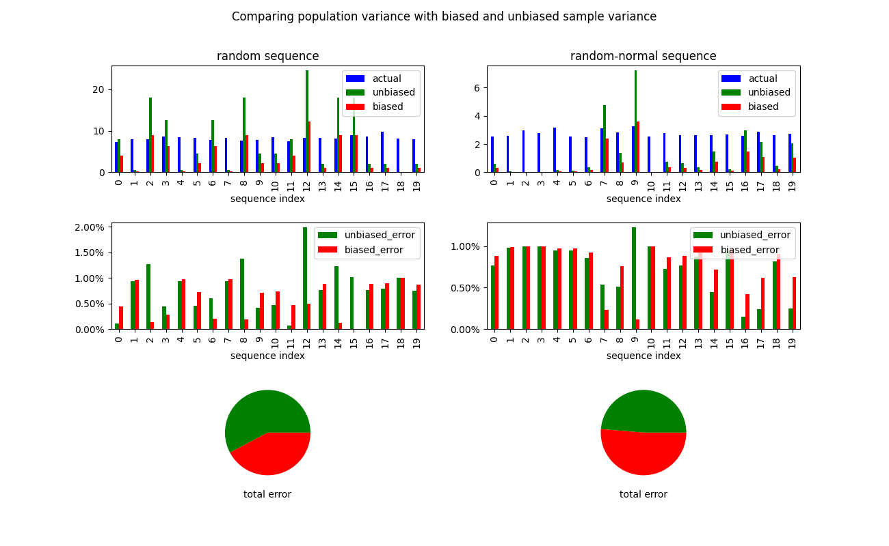

# sample_variance

Trying to see if the unbiased sample variance is more accurate than the biased sample variance for random samples of small sizes. 

*Based on my basic testing*

This does not hold for randomly distributed variables, but sometimes holds for normally distributed variables.

